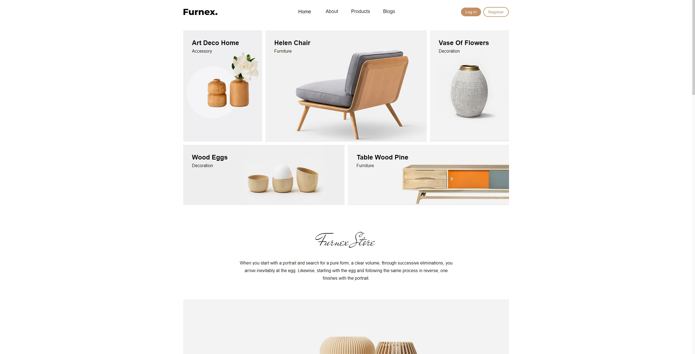

# CC Full Stack Ecommerce App

This project is a simple full stack ecommerce app that provides the backend functionality for an ecommerce website, and the frontend built with react. It is built using the following technologies:

- Node.js
- Express.js
- PostgreSQL
- Stripe

## Features

- User authentication and authorization
- Product management
- Cart functionality
- Order management
- Payment integration

## Installation

1. Clone the repository.
2. Install the dependencies by running `npm install`.
3. Set up the environment variables.
4. Run the client and the server with `npm run dev`.

## Usage



You may also view the project [HERE](https://cc-ecommerce.onrender.com/)

To use this API, you need to have a Postgres database set up. In order to set up the database run `npm run setup`, and in order to seed the database run `npm run seed`.

You must setup a `.env` file at the root of the project containing the following variables:

```
# Optional (If provided, uses this instead of DB vars below)
DB_URL = <Your Postgres URL>
NODE_ENV = <Set to production if trying to secure cookies>

# DB Vars
DB_HOST = <Your DB Host>
DB_USER = <Your DB User>
DB_PASS = <Your DB Password>
DB_PORT = <Your DB Port>
DB_DATABASE = <Your Postgres Database name>
SECRET_KEY = <Secret Key for use with Postgres>

# Google
GOOGLE_CLIENT_ID= <Your Google Client ID>
GOOGLE_CLIENT_SECRET= <Your Google Client Secret>

# Stripe
STRIPE_SECRET_KEY = <Your Stripe Secret Key>

# Client / Server
PORT = <Port for use in the server>
CLIENT_URL = <Your Client URL (Remove variable if serving on same as server url (production))>
SERVER_URL = <Your Server URL>
```

Once all environment variables are set up, you can start the server with `npm start` or run both the client & the server with `npm run dev`.

### API Endpoints

- `/api/users` - User related endpoints
- `/api/products` - Product related endpoints
- `/api/cart` - Cart related endpoints
- `/api/orders` - Order related endpoints
- `/api/checkout` - Checkout related endpoints
- `/api/docs` - Swagger Docs for API

Please view api documentation in the .yaml file included in the /api directory. Alternatively visit the /docs endpoint once the server is running.

## Credits

- [Base Design](https://github.com/codewithsadee/woodex)

## Roadmap

Here's a list of some future plans to implement if the project sees attention or as I have the time:

- Prevent layout shifts when loading home page
- Make loading skeletons for product list load properly on lower screen sizes
- Restyle order list

## Contributing

Contributions are welcome! If you find any issues or have suggestions for improvements, please open an issue or submit a pull request.

## License

This project is licensed under the MIT License. See the [LICENSE](LICENSE) file for more details.
